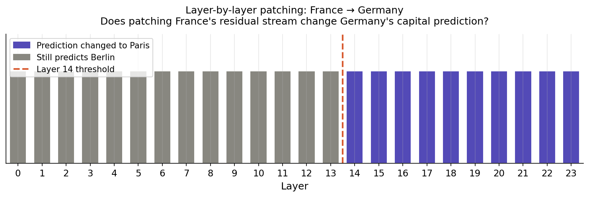
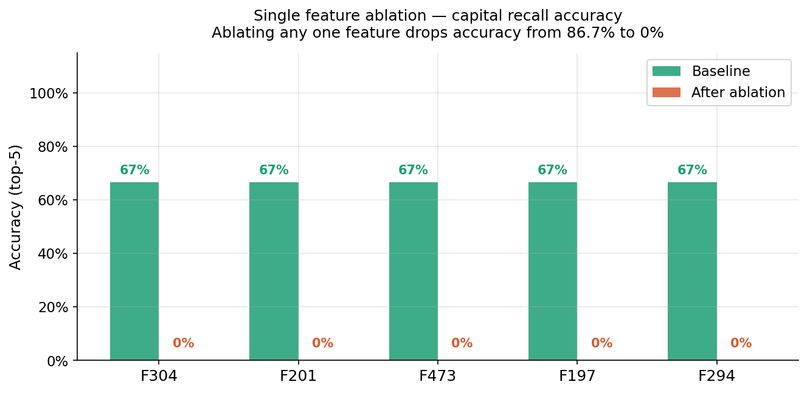
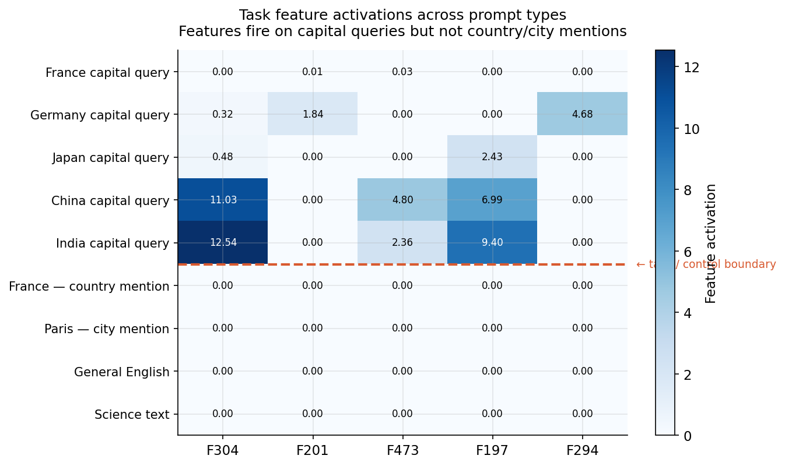
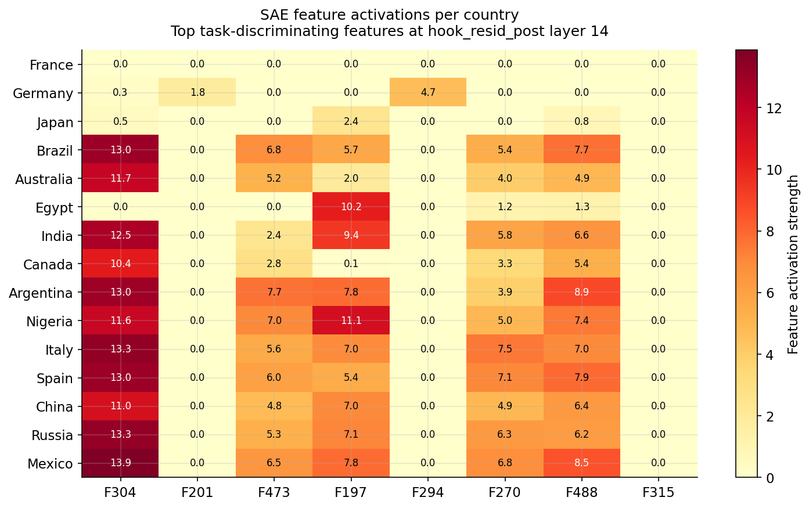

# SAE Feature Explorer

Mechanistic interpretability via sparse autoencoders on GPT-2 Medium.
Identifies and causally validates the internal features responsible for
country-capital factual recall.

**Key result:** Ablating a single SAE feature drops capital recall
accuracy from 86.7% to 0% — revealing features that causally gate
the entire recall pathway.

📄 [Alignment Forum post](YOUR_POST_URL) |
🎮 [Live Gradio demo](YOUR_GRADIO_URL) |
🔬 Built with [TransformerLens](https://github.com/neelnanda-io/TransformerLens)

---

## Key findings

### Finding 1 — Capital information lives in the attention stream

Layer-by-layer patching (France → Germany) shows capital identity
first appears at `hook_resid_post` layer 14. Patching `hook_mlp_out`
at any layer has no effect.



### Finding 2 — Single features causally gate recall

Ablating any one of five SAE features drops accuracy from 86.7% → 0%.
Post-ablation outputs are incoherent ("First", "A", "My") rather than
wrong capitals — consistent with a gating mechanism, not direct storage.



### Finding 3 — Features are selective for capital queries

Task features fire on capital query prompts but not on bare country
or city mentions, confirming they encode query structure rather than
geographic entities.



### Finding 4 — Recall breadth correlates with country frequency

Asian and South Asian countries (Japan, China, India) activate more
features than Western European countries (France, Germany, Italy),
suggesting factual recall difficulty scales with training data frequency.



---

## Results

| Metric | Value |
|--------|-------|
| Model | GPT-2 Medium (345M) |
| Hook point | `hook_resid_post`, layer 14 |
| SAE dict size | 512 |
| SAE L0 (avg active features) | 149 / 512 |
| Dead features | 0% |
| Baseline accuracy | 86.7% (13/15 countries, top-5) |
| Accuracy after ablating F304 | **0.0%** |
| Accuracy after ablating F201 | **0.0%** |
| Accuracy after ablating F473 | **0.0%** |
| First layer with capital info | Layer 14 (`hook_resid_post`) |

---

## Repo structure
```
sae-feature-explorer/
├── sae/
│   ├── activations.py     # Hook into GPT-2 via TransformerLens
│   ├── model.py           # SAE architecture + dead feature revival
│   ├── train.py           # Training loop with W&B logging
│   ├── features.py        # Feature profiling + discrimination analysis
│   └── ablation.py        # Causal ablation + activation patching
├── explorer/
│   └── app.py             # Interactive Gradio explorer (5 tabs)
├── notebooks/
│   ├── 01_collect_activations.ipynb
│   ├── 02_train_sae.ipynb
│   ├── 03_analyse_features.ipynb
│   ├── 04_ablation_experiments.ipynb
│   └── 05_visualise_results.ipynb
├── configs/
│   ├── sae_small.yaml     # GPT-2 Small config
│   └── sae_medium.yaml    # GPT-2 Medium config (used in paper)
├── data/
│   └── country_capitals.json
├── results/
│   ├── figures/           # All paper figures
│   ├── feature_labels_resid14.json
│   └── ablation_summary.json
└── FINDINGS.md            # Living research log
```

---

## Quickstart
```bash
git clone https://github.com/YOUR_USERNAME/sae-feature-explorer
cd sae-feature-explorer
pip install -r requirements.txt
```

**Run the Gradio explorer:**
```bash
python -m explorer.app
```

**Reproduce in Colab:**
Open `notebooks/01_collect_activations.ipynb` — all dependencies
install in the first cell.

**Retrain the SAE:**
```bash
python -m sae.train --config configs/sae_medium.yaml
```

---

## Technical details

The SAE was trained on activations from `blocks.14.hook_resid_post`
rather than the more common `hook_mlp_out`. This choice was motivated
by a layer-by-layer patching experiment showing capital identity first
appears in the residual stream at layer 14 — not in any MLP output.

The training procedure follows [Towards Monosemanticity](https://transformer-circuits.pub/2023/monosemanticity/index.html)
with dead feature revival every 2,000 steps and decoder column
normalisation after every gradient step.

---

## Citation

If you build on this work:
```bibtex
@misc{sae-feature-explorer-2024,
  title  = {SAE Feature Explorer: Mechanistic Interpretability of
             Country-Capital Recall in GPT-2 Medium},
  author = {Sanka Vaas},
  year   = {2024},
  url    = {https://github.com/SankaVaas/sae-feature-explorer}
}
```

---

## References

- [Towards Monosemanticity](https://transformer-circuits.pub/2023/monosemanticity/index.html) — Anthropic (2023)
- [Toy Models of Superposition](https://transformer-circuits.pub/2022/toy_model/index.html) — Elhage et al. (2022)
- [TransformerLens](https://github.com/neelnanda-io/TransformerLens) — Neel Nanda
- [In-context Learning and Induction Heads](https://transformer-circuits.pub/2022/in-context-learning-and-induction-heads/index.html) — Olsson et al. (2022)